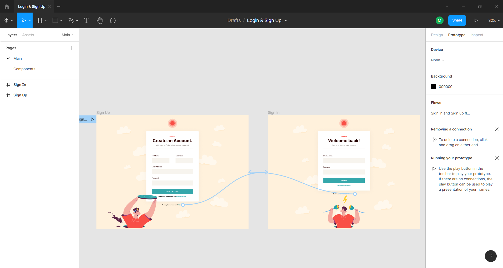
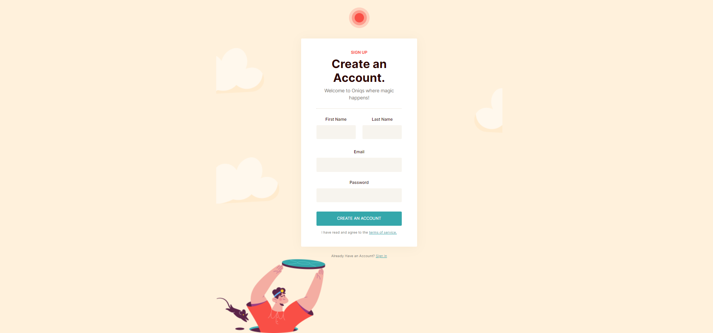

## Table of contents

- [Overview](#overview)
  - [The challenge](#the-challenge)
  - [Screenshot](#screenshot)
  - [Links](#links)
- [My process](#my-process)
  - [Built with](#built-with)  
- [Author](#author)

## Overview

This is a simple Figma design convterted to active desktop website project.

### The challenge

Users should be able to:

- View hover states on links and buttons.
- Click on "sign in" and "sign up" links to move between pages.

### Screenshots

### Links

- Live Site URL: [Simple Figma design to Website](https://slimbloodworth.github.io/simple-figma-to-HTML-project/)

## My process

I was looking for a quick, fun Figma project to add to my GitHub and found a great little project by Ari Pxl on YouTube.
I grabbed the image assets from [icons8.com](https://icons8.com/illustrations/style--sammy) and started working the layout in Figma. I used to Figma design to build the HTML and CSS. Pretty Basic.  

### Built with

- Figma 
- Semantic HTML5 markup
- CSS custom properties
- Flexbox

## Author

- CodePen - [@slimbloodworth](https://codepen.io/slimbloodworth)
- LinkedIn - [Michelle Renee Bloodworth](https://www.linkedin.com/in/michelle-renee-99b455187/)
- GitHub - [@slimbloodworth](https://github.com/SlimBloodworth)

